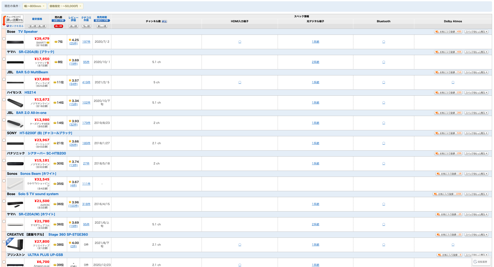
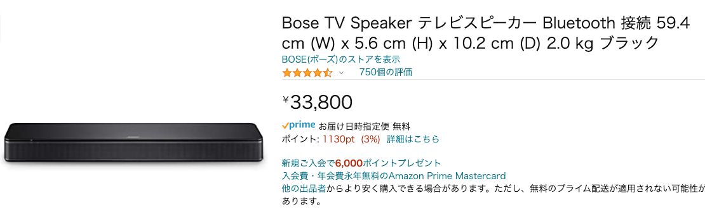
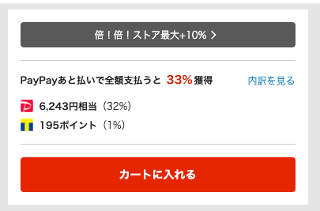
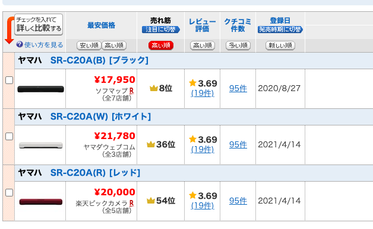
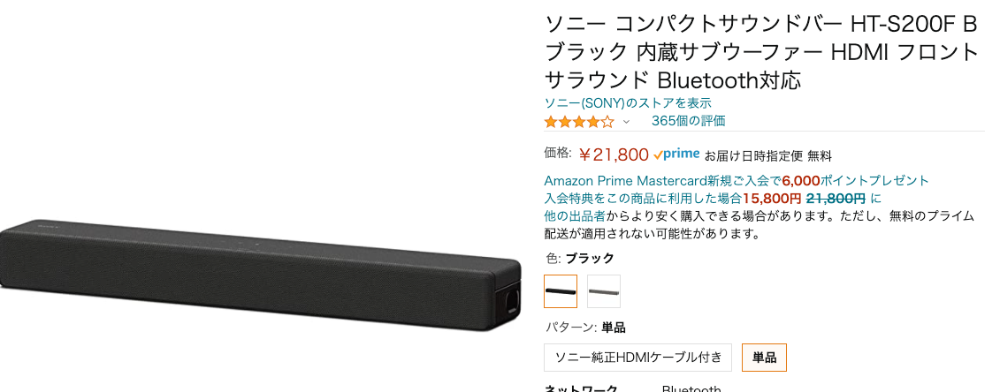
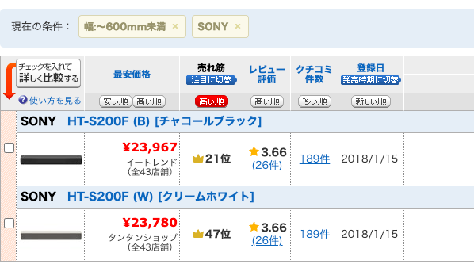

## スピーカー

横幅80cm以下で価格が50000円以下のものを価格.comから抜粋。


### BOSE TV Speaker
発売日：2020/07/02

```
本体サイズ(幅×高さ×奥行)mm：594 x 56 x 102
本体重量：2.0kg
ステレオ・モノラル：ステレオタイプ
入力プラグ/入力端子：光デジタル　HDMI
Bluetooth：Bluetooth対応
Bluetoothクラス：Ver.4.2
通信距離：10 m
付属品：専用リモコン 電源コード 光デジタルケーブル
仕様1：サブウーファー別売
仕様2：HDMIケーブル別売
```
https://www.amazon.co.jp/dp/B088G48JR7


超PayPay祭り中に購入すると還元が多い。しかも3万円以上で10%OFFクーポンが使える。
https://paypaymall.yahoo.co.jp/store/y-kojima/item/4969929254795/


### YAMAHA SR-C20A
発売日：2020/08/27

19000円前後
https://www.amazon.co.jp/dp/B092CYDSB9

https://paypaymall.yahoo.co.jp/store/best-denki/item/4219712013/?sc_i=shp_pc_search_itemlist_shsrg_img

https://paypaymall.yahoo.co.jp/store/yamada-denki-2/item/4219712013/?sc_i=shp_pc_search_itemlist_shsrg_img



```
実用最大出力(JEITA)：フロントL/R 20W×2、サブウーファー 30W
ユニット：フロントL/R(フルレンジ)4.6cmコーン非防磁型×2、ブウーファー 7.5cmコーン非防磁型×1、パッシブラジエーター×2
デコーダー機能：PCM(ステレオ)、ドルビーデジタル、ドルビープロロジックII、MPEG2 AAC(5.1chまで)
入力端子(音声入力)：3系統(光デジタル 2、3.5mm ステレオミニ 1)
出力端子(HDMI)：1系統(ARCに対応)
Bluetoothバージョン：Ver.5.0
Bluetooth対応プロファイル：A2DP
Bluetooth対応コーデック：SBC、AAC
Bluetoothクラス：Bluetooth Class1
Bluetooth最大通信距離：約10m(障害物が無いこと)
Bluetooth対応コンテンツ保護：SCMS-T方式
その他の端子：1系統(USB/アップデート専用)
消費電力：13W
待機消費電力
・HDMIコントロールオフ、Bluetooth(R)スタンバイオフ時：0.2W
・HDMIコントロールオン、Bluetooth(R)スタンバイオン時：0.4W
外形寸法(幅×高さ×奥行)
・テレヒ前置き設置時：600W×64H×94Dmm
・壁掛け設置時スペーサー含む：600W×64H×102Dmm
質量：1.8kg
付属品：リモコン（リチウムボタン電池セット済み）、ACアダプター、電源コード1本、光ケーブル（1.5ｍ）1本、壁掛け取付用テンプレート、壁掛け取付用スペーサー、スタートアップガイド、安全上のご注意
```



### ソニー HT-S200F
発売日：2018/01/27

https://www.amazon.co.jp/dp/B078Y5VFC7


```
型式:HT-S200F
JAN:4548736066601
HDMI端子（ARC対応）搭載により、テレビなどとHDMIケーブル1本で接続できるスリムなテレビ/ホームシアタースピーカー
サブウーハーを内蔵した2.1ch構成で、低音を増強するバスレフポートにより、コンパクトながらパワフルな低音を実現
Bluetooth対応により、スマートフォン・PC・オーディオ機器などに保存された音楽をワイヤレスで楽しめる
サラウンド最大出力:50W
ウーハー最大出力:30W
HDMI端子:1
光デジタル端子:1
サイズ:580x64x95mm
重量:2.3kg
```

